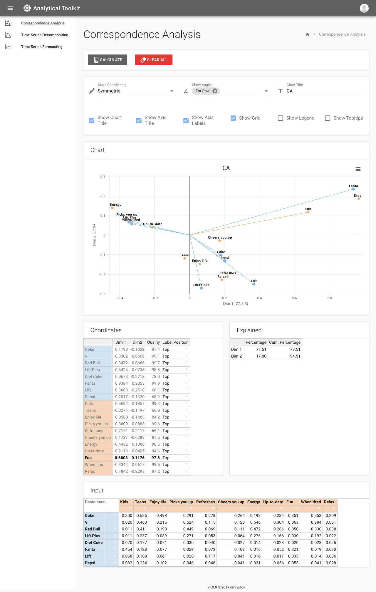
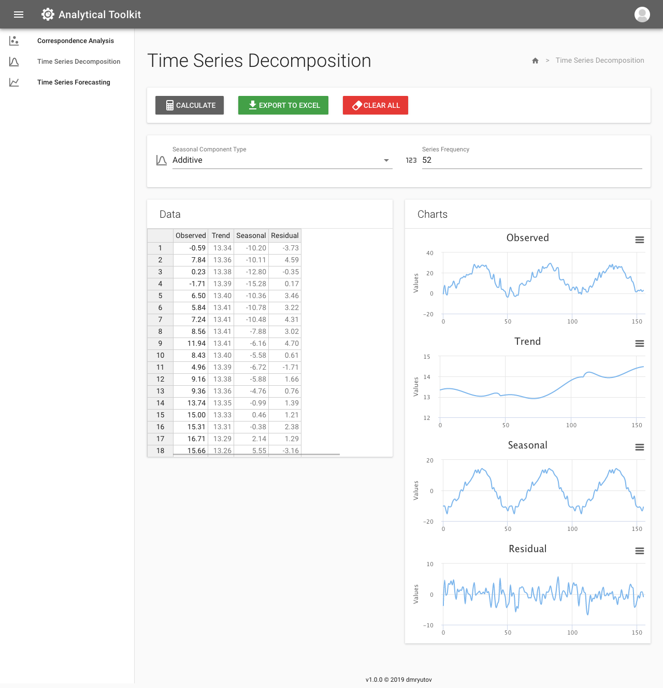
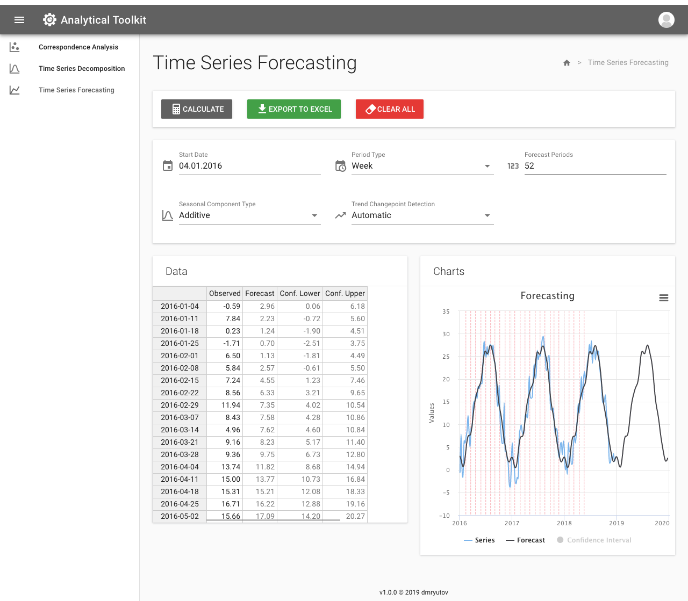

# Python Developer course. 2019-03. Final project

Final project for "Python Developer" course at otus.ru.

**Analytical Toolkit** - toolkit that designed to simplify everyday routine of analytics.

Features:

- Correspondence analysis
- Time series decomposition
- Time series forecasting
- Authentication
- Exporting to Excel


### Screenshots








## Backend

- Python 3
- Django
- Django REST Framework
- PostgreSQL


## Frontend

- Vue.js
- Vuetify
- SASS
- Babel
- Webpack


## Backend Setup 

Clone the repository:

```bash
git clone https://gitlab.omd.ru/OMd-brand-science/analytical-toolkit
cd analytical-toolkit
```

Create `.env` file (use [env.example](env.example) as a template):

```bash
cat > .env << END
...
END
```

| Variable              | Section   | Type   | Description |
| --------------------- | :-------: | :----: | --- |
| POSTGRES_DB           | DB        | string | Database name |
| POSTGRES_USER         | DB        | string | Database user name |
| POSTGRES_PASSWORD     | DB        | string | Database user password |
| POSTGRES_HOST         | DB        | string | Database host |
| POSTGRES_PORT         | DB        | int    | Database port |
| SCHEDULE              | DB backup | string | Cron-schedule specifying the interval between postgres backups |
| BACKUP_KEEP_DAYS      | DB backup | int    | Number of daily backups to keep before removal |
| BACKUP_KEEP_WEEKS     | DB backup | int    | Number of weekly backups to keep before removal |
| BACKUP_KEEP_MONTHS    | DB backup | int    | Number of monthly backups to keep before removal |
| DEBUG                 | Backend   | bool   | Django debug mode |
| SECRET_KEY            | Backend   | string | Django secret key ([generator](https://djecrety.ir/)) |
| VUE_APP_API_URL       | Frontend  | int    | Backend API URL |
| VUE_APP_COOKIE_DOMAIN | Frontend  | int    | Token cookies domain name |

Install dependencies:

```bash
cd backend
pip install -r requirements.txt
```

Make migrations:

```bash
./manage.py makemigrations
./manage.py migrate
```

Start server for your REST-API:

```bash
./manage.py runserver 127.0.0.1:8000
```


## Frontend Setup

Go to root and Open another terminal window

```bash
cd frontend
```

Install dependencies:

```bash
npm install
```

Run server:

```bash
npm run serve
```

To see live application open [http://localhost:8001](http://localhost:8001) in your browser window


## Docker

For development:

```bash
docker-compose -f docker-compose.dev.yml up --build
```

For production:

```bash
docker-compose up -d --build
```


## Testing

### Backend

```bash
python3 manage.py test -k
```

### Frontend

```bash
npm run test
```
