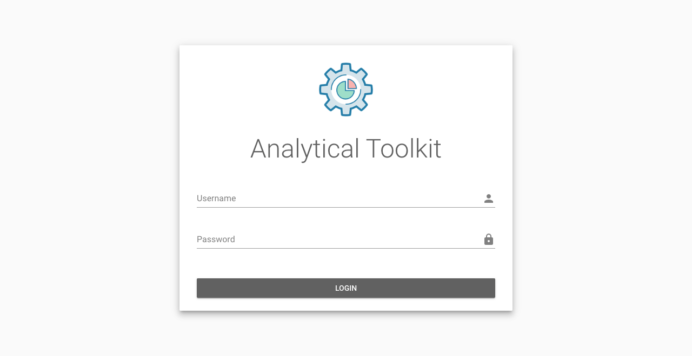
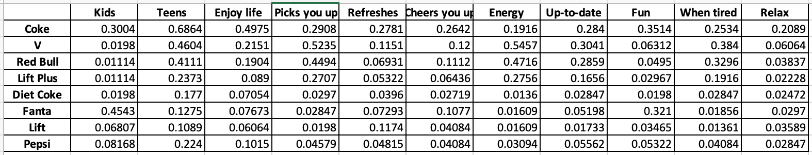
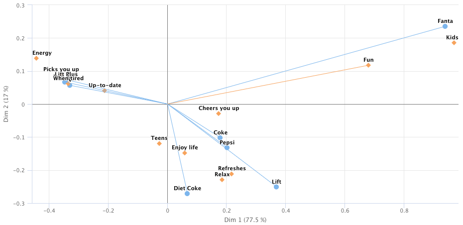
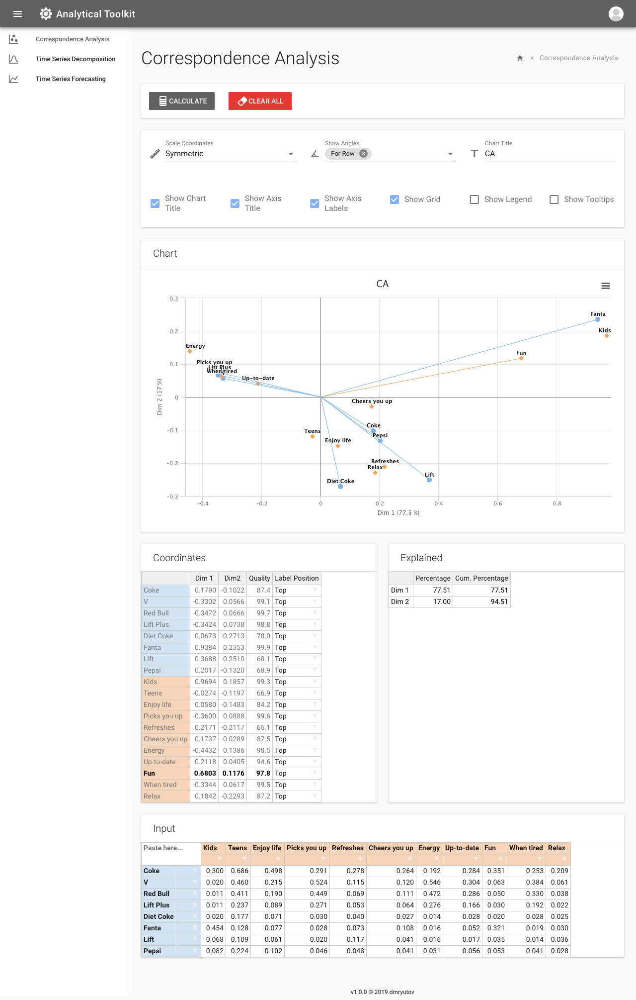
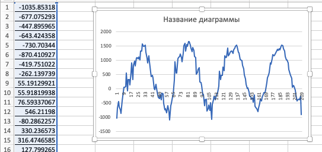
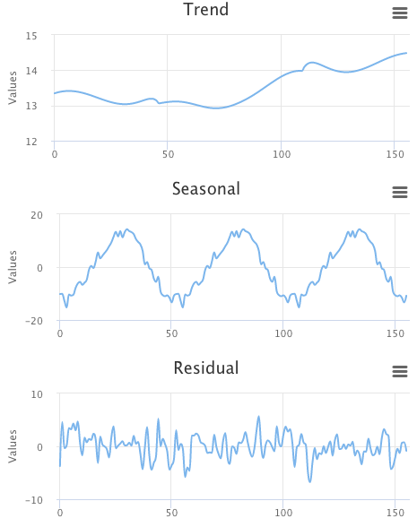
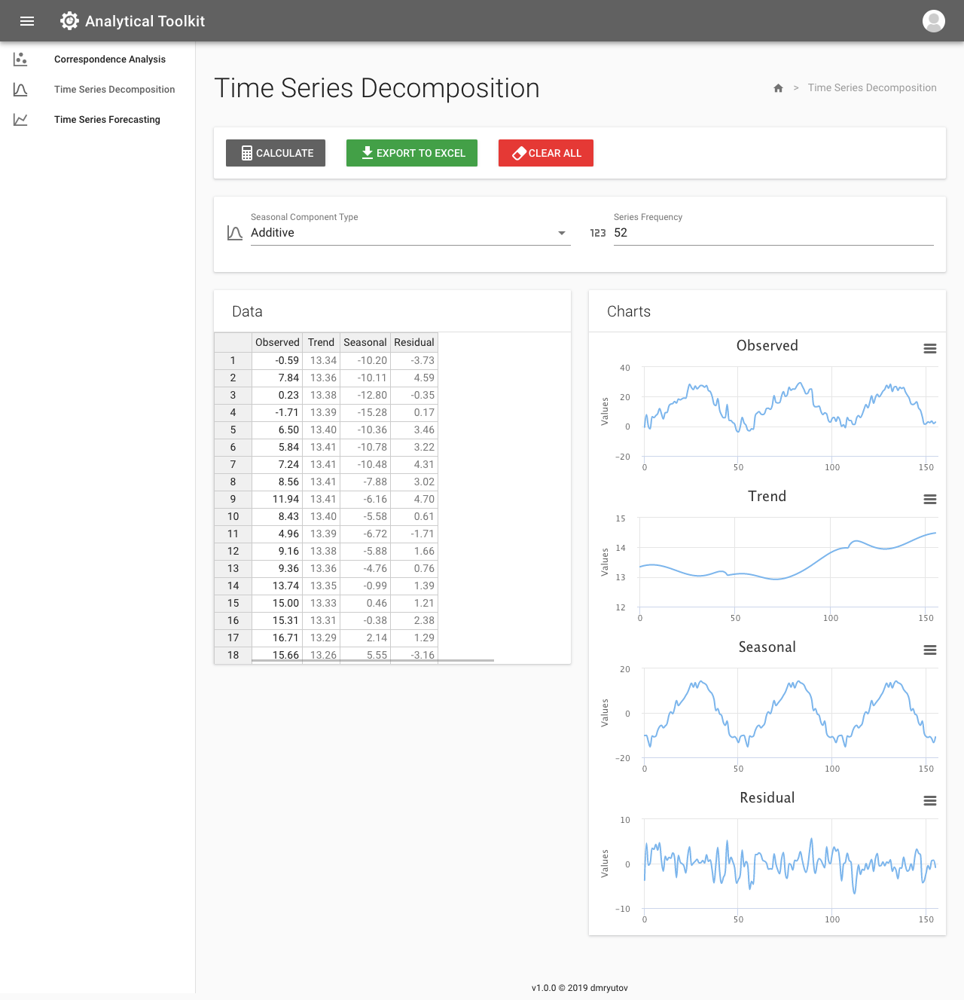
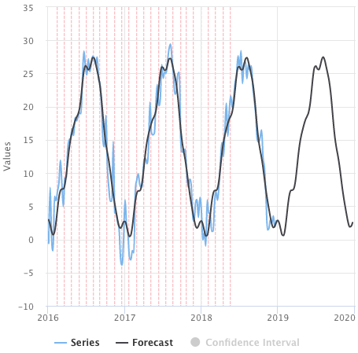
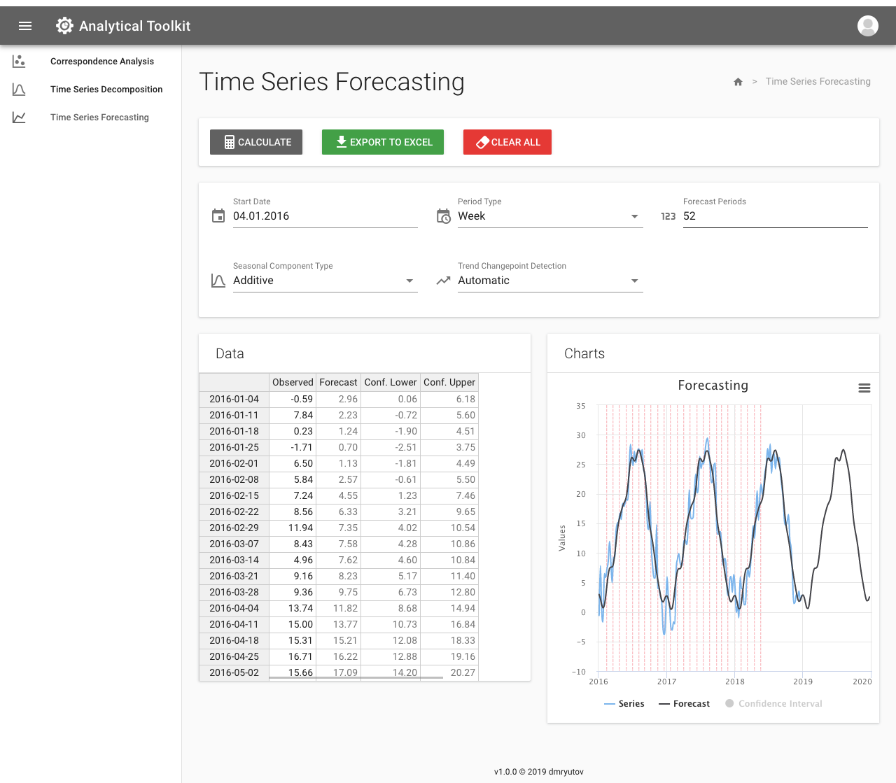
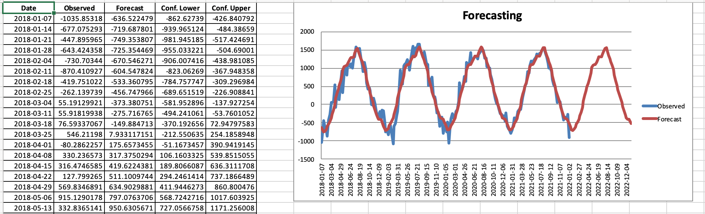

# Analytical Toolkit

- [Описание](#описание)
- [Стек технологий](#стек-технологий)
- [Функционал](#функционал)
	- [Авторизация](#авторизация)
	- [Ввод данных](#ввод-данных)
	- [Correspondence analysis](#correspondence-analysis)
	- [Time series decomposition](#time-series-decomposition)
	- [Time series forecasting](#time-series-forecasting)
	- [Визуализация данных](#визуализация-данных)
	- [Экспорт в Excel](#экспорт-в-excel)

## Описание

**Analytical Toolkit** — сервис, который предназначен для упрощения повседневной деятельности аналитиков. Представляет собой набор независимых инструментов для анализа и визуализации различных показателей. Независимость компонентов означает, что сервис в дальнейшем можно легко расширить новыми модулями.

## Стек технологий

- **Backend**
	- Python 3.x
	- Django
	- Django REST Framework
- **Frontend**
	- Vue.js
	- Vuetify
	- SASS
	- Babel
	- Webpack
- **База данных**
	- PostgreSQL
	- postgres-backup-local
- **Сервер**
	- Gunicorn
	- Nginx

Для упрощения запуска всего стека используется Docker. Описание всех контейнеров находится в файле `docker-compose.yml`.

## Функционал

### Авторизация

Для ограничения доступа к сервису была добавлена система пользователей и механизм авторизации.

Для авторизации использован механизм **JWT (JSON Web Token)**, который реализован с помощью библиотеки `djangorestframework_simplejwt`. В процессе создается 2 типа токенов — для доступа (малый срок действия) и для обновления (большой срок действия). Эти токены хранятся на клиенте в cookies.

Страница авторизации:

### Ввод данных

#### Описание
Для ввода данных была использована библиотека `handsontable`. Она является интуитивно понятной для аналитиков, привыкших работать с Excel.

#### Преимущества библиотеки

- Copy/Paste данных
- Протягивание ячеек
- Стабильная работа с большим объемом данных
- Кастомизация отдельных элементов таблицы

### Correspondence analysis

#### Постановка задачи

**Анализ соответствий (correspondence analysis)** является одной из разновидностью факторного анализа. Предоставляет собой графический метод изучения взаимосвязи между переменными в таблице пересечений. Вводные данные для анализа чаще всего являются категориальными. Конечным результатом анализа является двухмерная визуализация заданных переменных для дальнейшего изучения и интерпретации исходных данных.

Пример входных данных:

Пример результата расчетов:

#### Возможности сервиса

- Расчет CA
- Расчет суплементарных факторов (supplementary factors)
- Масштабирование координат факторов
- Визуализация результатов
- Полная настройка графика с результатами
- Вставка данных из Excel
- Экспорт графика с результатами в PNG

#### Выбор библиотеки

Для анализа соответствия была выбрана библиотека `prince`, которая умеет считать анализ соответствий (CA), множественный анализ соответствий (MCA), метод главных компонент (PCA). Основной недостаток — в отличие от функции `CA` из пакета `FactoMineR` для R не умеет считать суплементарные факторы.

#### Процедура расчета
 
 - Подготовка данных — создание датафрейма, из которого убраны суплементарные строки/столбцы
 - Создание объекта `ca` класса `prince.CA` и вызов метода `fit`
 - Расчет суплементарных факторов
 - Расчет качества (вклад квадрата каждого фактора в общую сумму)
 - Формирование результата

### Time series decomposition

#### Постановка задачи

**Time series decomposition** — разложение временного ряда на три составляющие — тренд, сезонность, остатки. В данном сервисе разложение осуществляется одним из основных методов решения задачи — STL.

**STL (A Seasonal-Trend Decomposition Procedure Based on Loess)** — процедура декомпозиции временного ряда на сезонную, трендовую составляющие и на остатки, использующую метод локальных регрессий (LOESS). И именно с помощью LOESS и происходит сглаживание исходного ряда данных.

Пример входных данных:

Пример результата расчетов:

#### Возможности сервиса

- Расчет STL
- Поддержка аддитивной и мультипликативной модели
- Настройка периода сезонной компоненты
- Визуализация результатов
- Вставка данных из Excel
- Экспорт результатов в Excel

#### Выбор библиотеки

Для расчета STL было найдено 3 пакета:

1) `rpy2` — обертка над R для Python. Позволяет вызвать функцию `stl` из пакета `stats`. Основной недостаток — в системе должен быть установлен R.
2) `statsmodels` — пакет, который предоставляет набор классов/функций для оценки различных статистических моделей. Основной недостаток — из-за особенностей реализации алгоритма теряются пограничные точки в трендовой компоненте.
3) `stldecompose` — пакет, который вдохновлен `statsmodels`, но использует другой метод расчета тренда. Данный пакет и был выбран в качестве основного.

#### Процедура расчета

- Подготовка данных — так как метод STL подходит только для аддитивных моделей, то в случае мультипликативных моделей необходимо прологарифмировать исходные данные с помощью функции `log`
- Вызов функции `stldecompose.decompose`
- Обратное преобразование значений всех компонент с помощью функции `exp` (только для мультипликативных моделей)
- Формирование результата

### Time series forecasting

#### Постановка задачи

**Time series forecasting** — прогнозирование будущих значений временного ряда на основании предыдущих наблюдаемых значений.

Пример входных данных:

Пример результата расчетов:

#### Возможности сервиса

- Расчет прогноза
- Поддержка аддитивной и мультипликативной модели
- Настройка периода сезонной компоненты
- Точная настройка функции обнаружения точек изменения тренда (changepoints)
- Визуализация результатов
- Вставка данных из Excel
- Экспорт результатов в Excel

#### Выбор библиотеки

Для прогнозирования временных рядов была выбрана библиотека `fbProphet`, которая реализована как для Python, так и для R. Однако данная библиотека имеет ряд недостатков:

1) При сборке пакет требует наличие заранее установленного модуля `pystan`, который сам поставить не может. Для решения этой проблемы пришлось создать дополнительный файл с зависимостями `requirements.init.txt`, который используется в процессе сборки контейнера.
2) Во время работы пакет выводит в консоль промежуточную информацию о каждой итерации, и это нельзя отключить. Для решения этой проблемы необходимо использовать [контекстный менеджер](https://github.com/facebook/prophet/issues/223), который перенаправляет поток вывода в `/dev/null`.
3) При импорте пакета слетают установленные уровни логирования (модуль `logging`). Для решения этой проблемы необходимо использовать контекстный менеджер, который сначала сохраняет настройки, а потом восстанавливает их.

#### Процедура расчета

- Подготовка данных — формирование датафрейма из значений и интервала дат (`pd.date_range`)
- Создание объекта `m` класса `fbprophet.Prophet` и вызов метода `fit`
- Формирование серии дат на прогнозируемый период (`m.make_future_dataframe`)
- Вызов функции `m.predict`
- Формирование результата

### Визуализация данных

Для визуализации данных была использована библиотека `highcharts`.

#### Преимущества библиотеки

- Поддержка большого числа типов графиков
- Экспорт в PNG, PDF
- Стабильная работа с большим объемом данных
- Адаптивная верстка
- Простота настройки

### Экспорт в Excel

#### Описание

Для сохранения результатов расчетов в сервис добавлена возможность экспорта данных в Excel. Данная процедура осуществляется с помощью библиотеки `openpyxl`.

Пример сгенерированного документа:

#### Процедура формирования документа

- Создание документа `wb` (`openpyxl.Workbook`)
- Создание листа `ws` (`wb.create_sheet`)
- Добавление данных на лист (`ws[cell] = value`)
- Добавление стилей
- Добавление графиков (`ws.add_chart`)
- Сохранение в файл (`wb.save`) / отправка на клиент